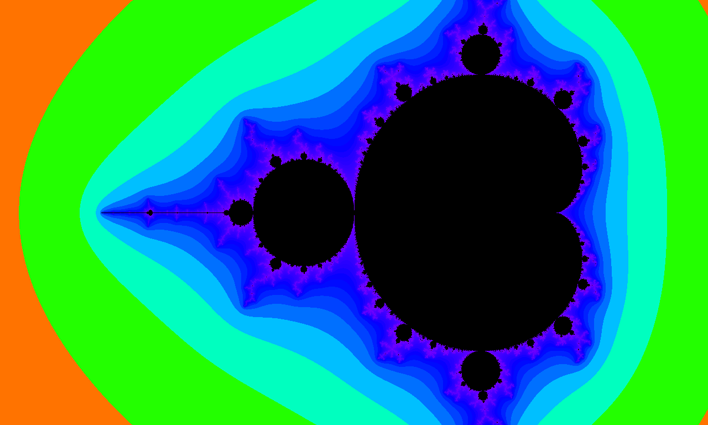

# gofrac
A simple library for generating fractals.

### Fractals

It's difficult to pin down a single, authoritative definition of exactly what a
fractal is. Self-similarity - though not necessarily repetition - seems to be a
central component. We've all seen images of fractals, whether it's a [Sierpiński
Triangle][sierpinski] or the famous [Mandelbrot set][mandel], either in movies
or popular science media.

The primary focus of this library as it currently stands is the production of
images generated by repeatedly applying a function to a point in the complex
plane. This includes Julia sets and, by extension, the Mandelbrot set. There is
also work being done to include a class of generative methods developed by
Kalantari and others which have been grouped under the name
[polynomiography][poly].

## Installation

To work with gofrac, you can use Go's package manager to install it by issuing
the following command:

```bash
go get github.com/cfdwalrus/gofrac
```

Additionally, you'll need Lucas Beyer's go-colorful package, which can be
found [here][colorful].

Having installed the requisite packages, you can use gofrac in your project
simply by including it with an import statement:

```go
import "github.com/cfdwalrus/gofrac"
```

## Using gofrac

For a quick start, see the examples in gofrac_examples.go.

The library has a modular design in which the selection of components
determines the output. These components are the class of fractal to be rendered,
the domain in which it is to be calculated, the selection and manipulation of
resultant quantities for plotting, and a palette consisting of a set of colors
coupled with a method by which they are chosen.

For example, in order to produce the classic image of the Mandelbrot set, one
would choose the appropriate components. (N.B.: Other classes of fractals are
available in the library, and you are free to create your own!)

### Choose a class of fractal

The first step is to choose a class of fractal. The Mandelbrot struct
implements the complex quadratic equation used to produce it, so we would
create an instance of it with an appropriate escape radius - say, 80.0. 

```go
m := gofrac.NewMandelbrot(80.0)
```

### Specify a domain

With that determined, the next choice is which points in the complex plane
should be rendered. The majority of the Mandelbrot set lies in the rectangle
spanned by the points (-2.5, -1.0) and (1.0, 1.0), where the point (a, b)
represents a complex number a + bi. Setting the number of samples to be taken
along each axis of the bounded area allows gofrac to calculate the points at
which it should iteratively apply the Mandelbrot map.

```go
w := 1280
h := 768
d, err := gofrac.NewDomain(-2.5, -1.0, 1.0, 1.0, w, h)
```

### Plot the results

It's time to choose which part(s) of the output are important. For our example,
that is the escape time, i.e. how many iterations it took for the modulus of
the iterate to exceed the escape radius chosen earlier. Since this happens
almost immediately away from the boudary of the set, normalizing the escape
times will perhaps yield a more visually interesting result.

```go
plot := gofrac.NormalizedEscapeTimePlotter{}
```

### Add some color

In order to visualize the values produced by the plotter, gofrac uses a color
palette. For the purposes of this library, a palette is anything that takes a
floating-point value and the maximum number of iterations to be performed
before considering a value to have converged. There are several such palettes
defined in [palette.go](palette.go) to choose from, as well as more concrete
examples in [palette_example.go](palette_example.go).

```go
pal := gofrac.SpectralPalette{Sweep: 270, Offset: 0}
```

### Maximum iterations

The final parameter to choose is the maximum number of iterations to perform
before an unescaped point is considered to converge. Tuning this parameter will
increase both the level detail in the resulting image as well as the time
needed to produce it.

```go
maxIt := 250
```

### Generating an image

With everything chosen, the only thing left to do is to tell gofrac to create
an image for you. The GetImage function does exactly that. Using the objects
defined above, one issues the call

```go
img, err := gofrac.GetImage(m, d, &plot, pal, maxIt)
```

GetImage returns an *image.RGBA, which the standard library's various encoders
can use to write an encoded image to disk. Consult the documentation of Go's
[image][go-image] package for details.

After doing so, you should have the following image of the Mandelbrot set in
your filesystem. Way to go!



## Advanced usage

The GetImage function provides a convenient interface to generate images of
fractals in a one-off manner but precludes the reuse of results for multiple
rendering runs. The FracIt function will return a two-dimensional slice of
object containing the output quantities of the iterations. This slice can
then be passed to the Render function with different plotters and palettes
depending on your needs.


#License: 3-Clause BSD

Copyright (c) 2020, Andrew Quinn
All rights reserved.

Redistribution and use in source and binary forms, with or without
modification, are permitted provided that the following conditions are met:

- Redistributions of source code must retain the above copyright notice, this
  list of conditions and the following disclaimer.
  
- Redistributions in binary form must reproduce the above copyright notice,
  this list of conditions and the following disclaimer in the documentation
  and/or other materials provided with the distribution.
  
- Neither the name of the copyright holder nor the names of its contributors may
  be used to endorse or promote products derived from this software without
  specific prior written permission.

THIS SOFTWARE IS PROVIDED BY THE COPYRIGHT HOLDERS AND CONTRIBUTORS "AS IS" AND
ANY EXPRESS OR IMPLIED WARRANTIES, INCLUDING, BUT NOT LIMITED TO, THE IMPLIED
WARRANTIES OF MERCHANTABILITY AND FITNESS FOR A PARTICULAR PURPOSE ARE
DISCLAIMED. IN NO EVENT SHALL THE COPYRIGHT HOLDER BE LIABLE FOR ANY
DIRECT, INDIRECT, INCIDENTAL, SPECIAL, EXEMPLARY, OR CONSEQUENTIAL DAMAGES
(INCLUDING, BUT NOT LIMITED TO, PROCUREMENT OF SUBSTITUTE GOODS OR SERVICES;
LOSS OF USE, DATA, OR PROFITS; OR BUSINESS INTERRUPTION) HOWEVER CAUSED AND
ON ANY THEORY OF LIABILITY, WHETHER IN CONTRACT, STRICT LIABILITY, OR TORT
(INCLUDING NEGLIGENCE OR OTHERWISE) ARISING IN ANY WAY OUT OF THE USE OF THIS
SOFTWARE, EVEN IF ADVISED OF THE POSSIBILITY OF SUCH DAMAGE.


[colorful]: https://github.com/lucasb-eyer/go-colorful/blob/master/README.md
[go-image]: https://golang.org/pkg/image/
[mandel]: https://en.wikipedia.org/wiki/Mandelbrot_set
[poly]: https://www.cs.rutgers.edu/~kalantar/polynomiography/index.html
[sierpinski]: https://en.wikipedia.org/wiki/Sierpi%C5%84ski_triangle
